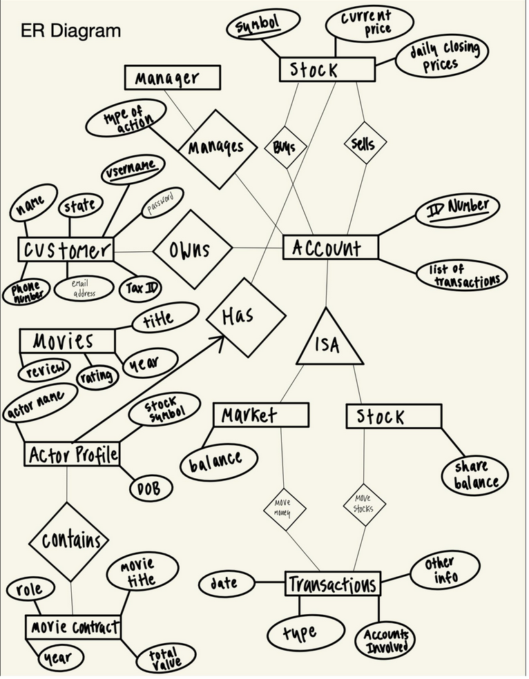

SQL and Java Stock Trading Application  
 
Implementation Details:  
* Maintain balance information for all customer accounts
* Maintain information on customers
* Process transactions (deposits, withdrawals, buy, sell, etc.)
* Generate monthly reports and update accounts with monthly interest
* Provide an interface for online trading and transactions, accessing necessary information about movies, actors and directors, the market, and necessary trading methods  

